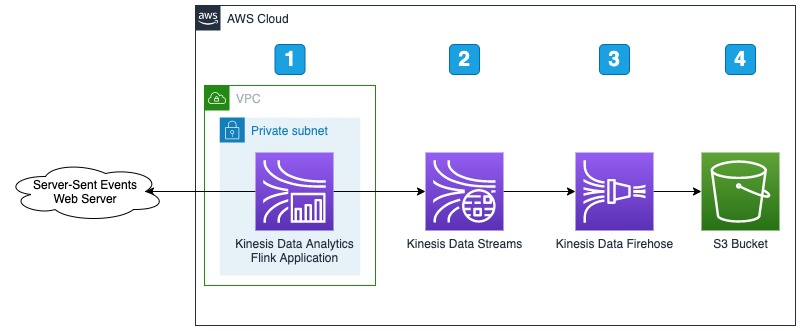

# Ingest Server-Sent Events (SSE) using Amazon Kinesis Data Analytics with Apache Flink

Server-Sent Events (SSE) allows clients to receive updates from an HTTP server connection. This sample shows how to connect to an SSE endpoint using an <a href="https://aws.amazon.com/kinesis/data-analytics/">Amazon Kinesis Data Analytics</a> application using Apache Flink. As the events arrive they are published to an <a href="https://aws.amazon.com/kinesis/data-streams/">Amazon Kinesis Data Streams</a> stream then in this sample we simply store the event data in <a href="https://aws.amazon.com/s3/">Amazon S3</a>.

## Architecture

1. An Amazon Kinesis Data Analytics application using Apache Flink is used to create a connection to the server-sent events HTTP endpoint. 
1. Each event that is ingested is published to the <a href="https://aws.amazon.com/kinesis/data-streams/">Amazon Kinesis Data Streams</a> stream. The application must be placed in a private subnet of a virtual private cloud (VPC) to allow for <a href="https://docs.aws.amazon.com/kinesisanalytics/latest/java/vpc-internet.html">outbound connections</a> to be made.
1. The <a href="https://aws.amazon.com/kinesis/data-firehose">Amazon Kinesis Data Firehose</a> receives the event payload from the data stream
1. The <a href="https://aws.amazon.com/s3/">Amazon Simple Storage Service</a> bucket is used to store the events for future analysis

## Requirements To Compile
1. Maven installed
2. Java 11 installed
1. <a href="https://aws.amazon.com/cdk/">AWS Cloud Development Kit</a> (CDK)

## Compiling
1. Git clone this repository
1. Run the maven package command "mvn package"

## Setup
1. Upload the compiled jar file ('amazon-kinesis-data-analytics-apache-flink-server-sent-events-{version}.jar') to an S3 bucket in the account you plan to run. 
2. The CDK will produce two different <a href="https://aws.amazon.com/cloudformation/resources/templates/">CloudFormation Templates</a>
   1. amazon-kinesis-data-analytics-apache-flink-server-sent-events-create-vpc.json
      1. This template will create a VPC for you with private and public subnets
   2. amazon-kinesis-data-analytics-apache-flink-server-sent-events-use-existing-vpc.json
      1. This template will allow you to select existing security group Ids and subnet Ids to use with the application
      2. The subnet Ids selected must be private to allow <a href="https://docs.aws.amazon.com/kinesisanalytics/latest/java/vpc-internet.html">outbound connections</a> from within an Amazon Kinesis Data Analytics Apache Flink application. 
      3. The security group Ids selected must allow outbound connections on the HTTP port required. In this sample we create an outbound connection on the standard HTTP port 80.
3. Fill in the required parameters:
   1. <b>S3Bucket</b> - The S3 bucket where the Amazon Kinesis Data Analytics application gets your application's JAR file
   2. <b>S3StorageBucket</b> - The S3 bucket name used to store the server-sent events data
   3. <b>S3StorageBucketPrefix</b> - The prefix used when storing server-sent events data into the S3 bucket
   4. <b>S3StorageBucketErrorPrefix</b> - The prefix used when storing error events into the S3 bucket
   5. <b>FlinkApplication</b> - The Apache Flink application jar file name located in the S3 bucket
   6. *<b>Subnets</b> - The subnets used for the Amazon Kinesis Data Analytics application (When using an existing VPC template)
   7. *<b>SecurityGroups</b> - The security groups used for the Amazon Kinesis Data Analytics application (When using an existing VPC template)

## Running
1. The sample included will set up the Amazon Kinesis Data Analytics application to connect to the <a href="https://wikitech.wikimedia.org/wiki/Event_Platform/EventStreams">wikimedia events streams</a> recent changes SSE endpoint.
2. <a href="https://docs.aws.amazon.com/kinesisanalytics/latest/java/get-started-exercise.html#get-started-exercise-7">Run the Kinesis Data Analytics Application</a> from the console or cli
3. Once the application is running, navigate to the S3 bucket supplied in the CloudFormation properties and view the event data records

## SSE Endpoints
To connect to a different endpoint you can edit the <a href="https://docs.aws.amazon.com/kinesisanalytics/latest/java/how-properties.html#how-properties-console">Amazon Kinesis Data Analytics Runtime Properties</a>. The following properties are available:
   1. Property Group: <b>ProducerConfigProperties</b>
      1. The key value pair properties in this group are fed directly into the FlinkKinesisProducer, please reference <a href="https://github.com/awslabs/amazon-kinesis-producer/blob/master/java/amazon-kinesis-producer-sample/default_config.properties">these properties</a>
      1. The key <b>AggregationEnabled</b> should ALWAYS be set to <b>false</b>
   2. Property Group: <b>OutputStreamProperties</b>
      1. DefaultStream</b> - The value of this property should be the Amazon Kinesis Data Streams stream that this application will output events to. Please be aware that the security role for the Amazon Kinesis Data Analytics application will require permissions to this stream.
   3. Property Group: <b>SSESourceProperties</b>
      1. <b>url</b> (required) - The SSE endpoint to connect
      1. <b>headers</b> - A pipe delimited set of key/value pair headers. For example "x-api-key|demo|Accept|text/html" is broken into key: x-api-key with value: demo and key: Accept with value: text/html
      1. <b>types</b> - A pipe delimited set of SSE event types to send to the data stream.
      1. <b>readTimeoutMS</b> - The read timeout value in milliseconds. Note in most cases adjusting this to anything but zero will cause the system to not connect.
      1. <b>reportMessagesReceivedMS</b> - How often to log the number of messages received over a given period of time in milliseconds.

## Resource Cleanup
### CloudFormation
1. Delete the CloudFormation stack
1. Remove the jar file from the S3 bucket

## Security

See [CONTRIBUTING](CONTRIBUTING.md#security-issue-notifications) for more information.

## License

This library is licensed under the MIT-0 License. See the LICENSE file.